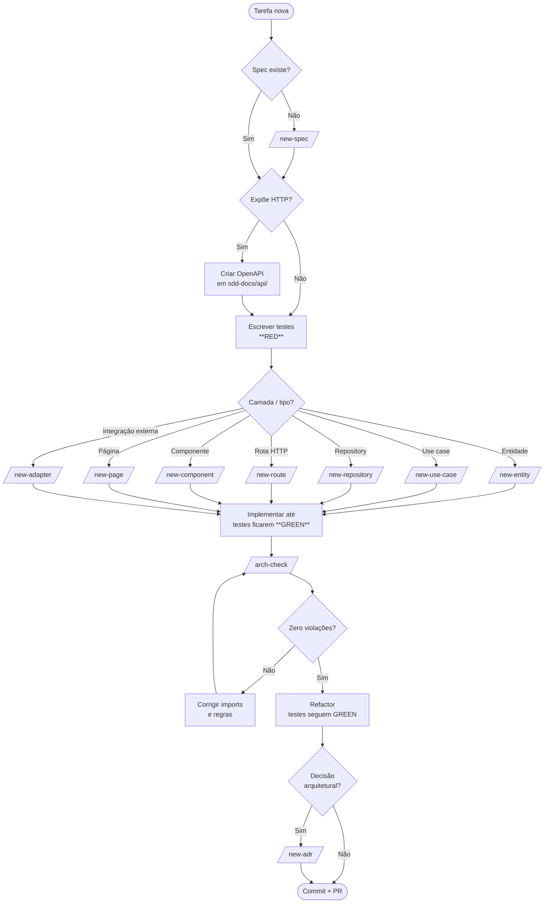

# Dev Loop — Gráfica Manager

Guia prático de como desenvolver o app trabalhando com o **Claude Code**. Tem três peças que conversam:

| Arquivo / pasta             | Papel                                                          |
| --------------------------- | -------------------------------------------------------------- |
| `CLAUDE.md`                 | **Regras vinculantes** — o Claude lê toda sessão               |
| `.claude/skills/*/SKILL.md` | **Skills** — automações que você invoca via `/<nome>`          |
| `DEV_LOOP.md` (este)        | **Workflow** — o ciclo que você segue                          |
| `sdd-docs/`                 | **Specs + ADRs + OpenAPI** — fonte de verdade da feature       |

---

## TL;DR

```
Spec → API contract → Test (Red) → Scaffold → Code (Green) → arch-check → Refactor → ADR (se preciso) → PR
```

Não pule etapas. Quando estiver tentado a pular, pare e pergunte ao Claude.

---

## Fluxograma



---

## O loop em detalhe

### Passo 0 — Abrindo a sessão

1. Abra o repositório no Claude Code. Ele lê `CLAUDE.md` automaticamente.
2. Diga **o que você quer fazer hoje** em uma frase. Ex.: *"Implementar criação manual de pedido."*
3. O Claude vai checar se há spec. Se não houver, ele sugere `/new-spec` antes de escrever código — **deixe ele**.

### Passo 1 — Spec (`/new-spec`)

A spec é o contrato com você-do-futuro. Sem ela, decisões viram improviso.

- Invoque `/new-spec`, responda às perguntas (nome, slug, contexto).
- O arquivo `sdd-docs/specs/NNNN-<slug>.md` é gerado com placeholders.
- **Você preenche os requisitos** — o Claude não inventa requisitos.
- Quando estiver satisfeito, peça para o Claude revisar a spec antes de prosseguir.

> Skip rules: trivialidades (typo em label, ajuste de cor) não precisam de spec. Qualquer mudança de comportamento ou estrutura, precisa.

### Passo 2 — API contract (se aplicável)

Se a feature expõe HTTP:

- Crie `sdd-docs/api/<resource>.yaml` (OpenAPI 3.x).
- Defina request/response/erros antes de implementar a rota.
- Refencie no campo "API Contract" da spec.

### Passo 3 — Testes Red

> Regra do CLAUDE.md: **sem teste, sem merge.**

Escreva testes que falham porque o código ainda não existe. Tipos:

| Onde                                  | O que testar                            |
| ------------------------------------- | --------------------------------------- |
| `tests/unit/domain/`                  | Entidades, VOs (criação, validações)    |
| `tests/unit/application/use-cases/`   | Caminho feliz + cada erro de domínio    |
| `tests/integration/database/`         | Repositórios contra MySQL real          |
| `tests/integration/http/`             | Rotas via supertest                     |
| `tests/e2e/`                          | Fluxos completos pela UI Electron       |

Rode `pnpm test` e confirme que falham com a mensagem certa (não falham por falta de import, falham porque o comportamento não existe ainda).

### Passo 4 — Scaffold

Em vez de digitar boilerplate, invoque a skill da camada certa:

| Você precisa de…                       | Skill                  |
| -------------------------------------- | ---------------------- |
| Conceito de domínio novo               | `/new-entity`          |
| Operação de aplicação                  | `/new-use-case`        |
| Persistir/consultar dados              | `/new-repository`      |
| Endpoint HTTP                          | `/new-route`           |
| Botão / Input / Modal / OrderCard…     | `/new-component`       |
| Tela / rota do frontend                | `/new-page`            |
| Integração com Shopee, ML, impressora  | `/new-adapter`         |

Cada skill conhece as convenções do `CLAUDE.md` — pastas, nomes, padrões, validações.

### Passo 5 — Código Green

Implemente o **mínimo** para os testes passarem. Não adicione funcionalidade fora do escopo da spec.

Sinais de que você está saindo do escopo:
- Adicionar campo "que talvez precisemos depois"
- Criar abstração para um único caller
- Adicionar try/catch para erros que não acontecem
- Refatorar algo que não está na spec

Pare e foque em ficar **green**.

### Passo 6 — `/arch-check`

Antes de commitar, rode `/arch-check`. Ela detecta:

- `domain/` importando Express/Prisma/qualquer infra
- `application/` importando `infrastructure/`
- Frontend com lib de UI proibida
- `any` explícito em código de produção
- `console.log` em código de produção
- Migrations Prisma editadas após commit
- Electron sem `contextIsolation`/`nodeIntegration: false`

Corrija até zerar violações. **Não suprima o relatório.**

### Passo 7 — Refactor

Com testes verdes e arquitetura limpa, melhore o código:
- Nomes mais claros
- Extrair função pura
- Reduzir aninhamento
- Remover código morto

Os testes continuam verdes durante o refactor. Se quebrar, o refactor mudou comportamento — não era refactor, era mudança.

### Passo 8 — ADR (se aplicável)

Se você (ou o Claude) tomou decisão arquitetural não óbvia: `/new-adr`.

Exemplos que viram ADR:
- Escolher Zod vs class-validator
- Decidir cuid2 em vez de uuid
- Adicionar lib que não está na stack obrigatória
- Abrir exceção a uma regra do `CLAUDE.md`

### Passo 9 — Commit + PR

- Conventional Commits em português: `feat: receber pedido manual`, `fix: validar assinatura webhook Shopee`.
- PR pequeno, foca em uma feature/fix.
- Use `/review` (skill global) para uma revisão automática antes de pedir review humano.

---

## Mapa rápido: "Quero fazer X"

| Quero…                                  | Comece por                       |
| --------------------------------------- | -------------------------------- |
| Subir o projeto pela primeira vez       | `/bootstrap-monorepo`            |
| Adicionar uma feature                   | `/new-spec` → fluxograma acima   |
| Documentar uma decisão                  | `/new-adr`                       |
| Criar tela nova                         | `/new-spec` → `/new-page`        |
| Integrar com Shopee/ML                  | `/new-spec` → `/new-adapter`     |
| Auditar antes do PR                     | `/arch-check` → `/review`        |
| Verificar segurança das mudanças        | `/security-review` (skill global)|
| Simplificar código que ficou complexo   | `/simplify` (skill global)       |

---

## Como conversar com o Claude

### O que funciona

- **Diga o objetivo, não os passos.** "Quero registrar quando uma página é impressa, com qualidade, papel e custo." O Claude monta o plano.
- **Forneça o contexto que o Claude não tem.** "A impressora HP do balcão tem driver X que não suporta Y." Ele não consegue inferir hardware.
- **Aceite quando ele pergunta antes de agir.** Se ele pede confirmação para algo destrutivo (deletar migration, force push), é proposital.
- **Use as skills.** Em vez de "cria um use case pra mim", `/new-use-case`. A skill já tem as regras embutidas.

### O que evita retrabalho

- **Não peça código sem spec.** Você vai descobrir o que faltou só na hora do PR.
- **Não pule `/arch-check`.** Violações de Clean Architecture são caras de corrigir depois.
- **Não diga "tanto faz" para escolhas técnicas.** Ele vai escolher; depois, mudar custa caro. Decida e registre em ADR.
- **Não aceite mudanças sem ler.** Skills geram código bom, mas você é o autor — entenda antes de commitar.

### Prompts que costumam dar certo

```
"Implementar a feature X conforme spec NNNN. Comece pelos testes."
"Revise o use case Y — está respeitando a spec?"
"Algo no diff atual viola o CLAUDE.md?"
"Estou em dúvida entre A e B para [problema]. Liste prós/contras de cada um pensando no alvo do projeto."
"Antes do PR, rode arch-check e me mostre o resumo."
```

---

## Alinhamento com o Roadmap

O `README.md` define 6 fases. Cada fase ⇒ várias specs. Sequência sugerida:

| Fase | Foco                      | Skills mais usadas                                            |
| ---- | ------------------------- | ------------------------------------------------------------- |
| 1    | Fundação                  | `/bootstrap-monorepo`, `/new-component` (UI primitivos)       |
| 2    | Core de impressão         | `/new-entity`, `/new-use-case`, `/new-adapter` (impressora)   |
| 3    | Pedidos e clientes        | `/new-entity`, `/new-repository`, `/new-route`, `/new-page`   |
| 4    | E-commerce                | `/new-adapter` (Shopee/ML), `/new-route` (webhooks)           |
| 5    | Dashboard                 | `/new-page`, `/new-component` (charts próprios), `/new-route` |
| 6    | Arquivo                   | `/new-adapter` (storage), `/new-use-case`                     |

---

## Anti-patterns que vão acontecer (e como sair deles)

| Sintoma                                              | Causa provável                          | Saída                                       |
| ---------------------------------------------------- | --------------------------------------- | ------------------------------------------- |
| `domain/` importou `@prisma/client`                  | Pulou a camada de mapper                | Mover persistência para repository + mapper |
| Página fica lenta carregando lista de pedidos        | Não virtualizou                         | Virtualização própria em `utils/`           |
| Teste de integração passa local mas falha no CI      | Banco diferente, ou seed não isolado    | `beforeEach` limpa tabelas; usar mesmo MySQL|
| Webhook aceita payload assinado errado               | Usou comparação `===` ou parseou body   | `timingSafeEqual` no `rawBody`              |
| Bundle do frontend cresceu muito                     | Importou lib pesada                     | `/arch-check` → remover; usar componente próprio |
| PR ficou enorme                                      | Misturou várias features                | Quebrar — uma spec por PR                   |

---

## Checklist do PR

Antes de abrir PR, confirme com o Claude:

- [ ] Spec existe e está atualizada
- [ ] OpenAPI atualizado (se HTTP)
- [ ] Testes unit + integration passam
- [ ] E2E passa (se UI mudou)
- [ ] `/arch-check` zerou violações
- [ ] `pnpm lint` zerou warnings
- [ ] ADR criada (se decisão arquitetural)
- [ ] `.env.example` atualizado (se variáveis novas)
- [ ] README/CLAUDE.md atualizados (se regra mudou)
- [ ] Commits seguem Conventional Commits

---

## Referências rápidas

- **Regras**: `CLAUDE.md`
- **Skills**: `.claude/skills/`
- **Specs**: `sdd-docs/specs/`
- **ADRs**: `sdd-docs/decisions/`
- **API contracts**: `sdd-docs/api/`
- **Roadmap**: `README.md` § Roadmap
